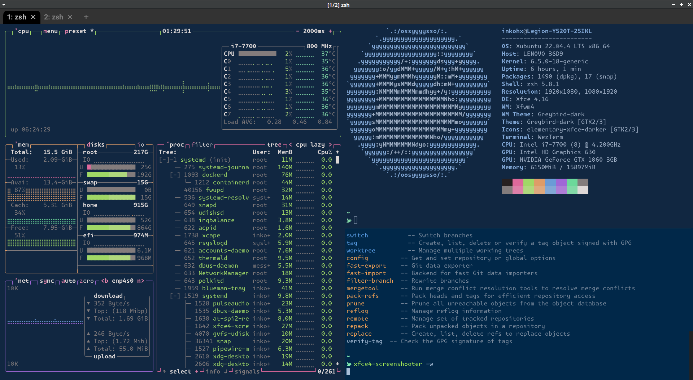

# dotfiles for xubuntu



私のxubuntu用構成ファイル（[InkoHX/dotfiles.archlinux](https://github.com/InkoHX/dotfiles)をベースにしています）

## 概要

**chezmoi**を使用して構成ファイルを管理しています。

- シェルは**zsh**を使用
  - プラグインなどの管理は**Sheldon**を使用
    - 遅延読み込み対応
  - プロンプトは**Starship**を使ってカスタマイズ
  - 補完機能強化に**Carapace**を使用
- ターミナルは**WezTerm**を使用
- フォントは**Moralerspace**を採用
- 入力メソッドは**Fcitx5 & Mozc**を使用
- 機密情報の管理には**Bitwarden**を使用
  - SSHの設定ファイルや秘密鍵
  - WakaTimeのAPIキー
- ツールチェーンの管理には**proto**を使用
  - Rust
  - Node.js
    - npm
    - pnpm
  - Bun
  - Deno

## 使い方

```bash
$ chezmoi inti InkoHX/dotfiles.xubuntu
```
